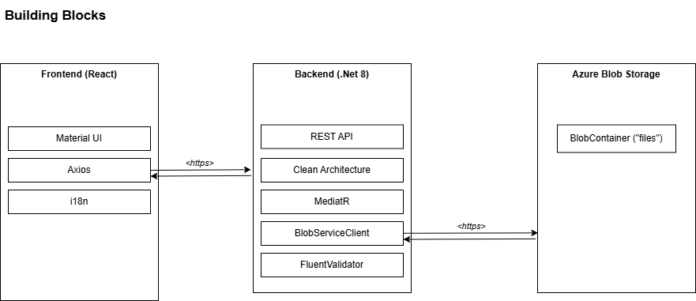
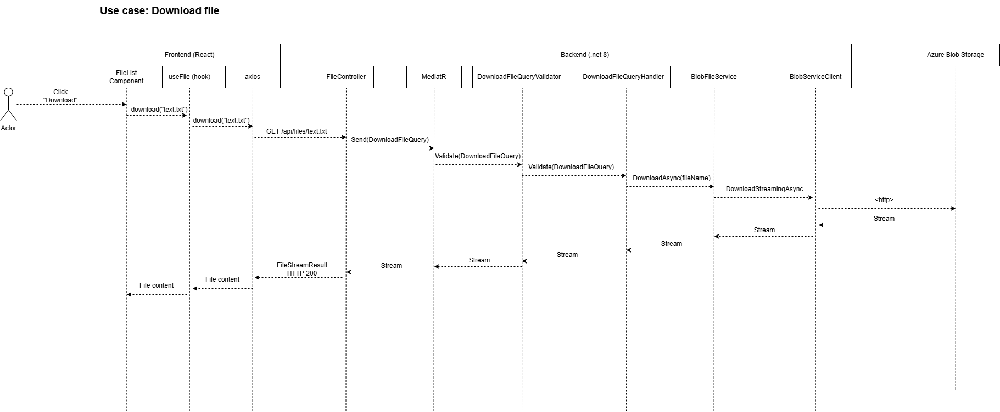

# File Management System

File management solution built with:

- **.NET 8 Web API**
- **Clean Architecture + Mediator Pattern**
- **Azure Blob Storage (streaming upload)**
- **React (Vite) + TypeScript + Material UI**
- **Docker Compose** support

This project demonstrates:
- large file streaming (no buffering)
- max-size streaming validation (custom `MaxSizeStream` decorator)
- problem-details based error responses
- i18n-ready frontend
- clean separation of layers
- dockerized full-stack app

---

# 🚀 Running the entire application with Docker

This is the recommended way.

### Set your Azure Storage connection string and container name in `docker-compose.yml`
- AZURE_STORAGE_CONTAINER_NAME: ""
- AZURE_STORAGE_CONNECTION_STRING: ""

---
# Diagrams

